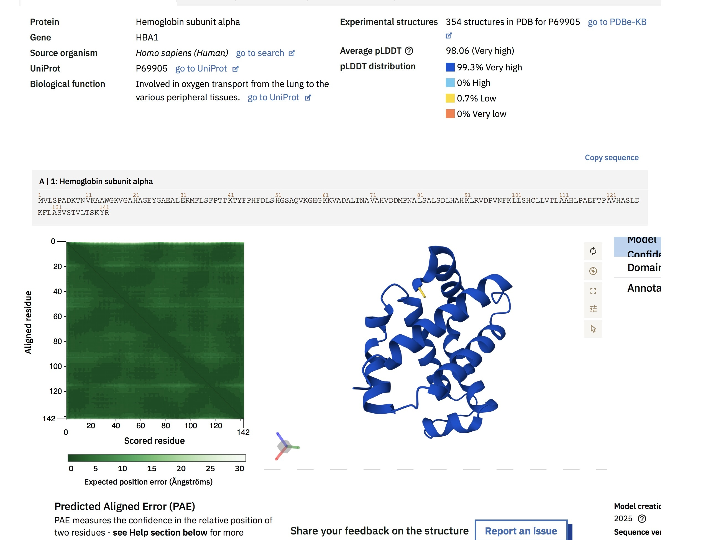

# Protein Structure Prediction of Hemoglobin Alpha Chain

## 📌 Overview
This project explores the predicted three-dimensional structure of the human hemoglobin alpha chain using the AlphaFold Protein Structure Database to investigate structural and functional characteristics.

## 🔬 Method
- Retrieved the predicted protein structure from the AlphaFold database
- Examined structural organization and confidence scores
- Analyzed Predicted Aligned Error (PAE)
- Investigated structure-function relationships

## 📊 Key Findings
- The predicted structure displayed a compact globular organization dominated by alpha-helices
- Most regions showed very high confidence scores (~99%)
- The PAE analysis suggested strong structural consistency across the protein model
- Structural features were consistent with known globin protein architecture

## 🧠 Biological Interpretation
The alpha-helical organization is characteristic of globin proteins and supports the biological role of hemoglobin in oxygen binding and transport. High confidence scores indicate that the predicted structure is highly reliable.

## 🛠 Skills Demonstrated
- Protein structure analysis
- Interpretation of AlphaFold confidence metrics
- Structural bioinformatics
- Structure-function relationship analysis
- Protein model interpretation

## 📁 Project Files
- PDF report with detailed explanation
- AlphaFold structure screenshots

## 📸 AlphaFold Output

